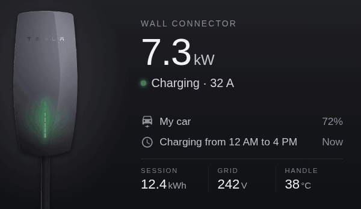
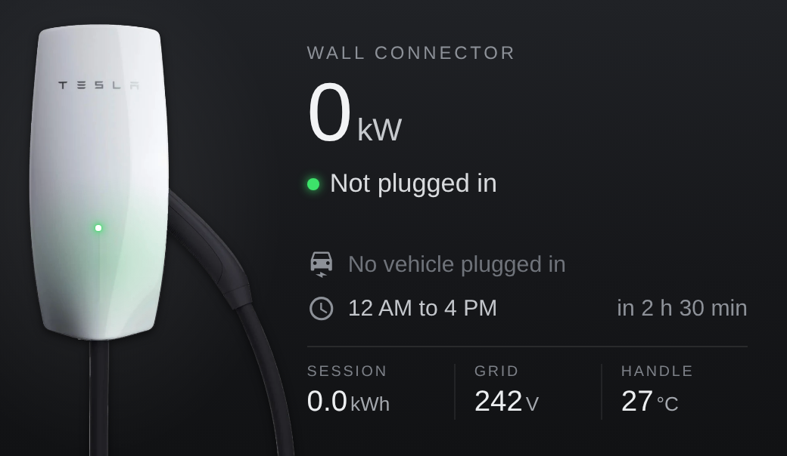
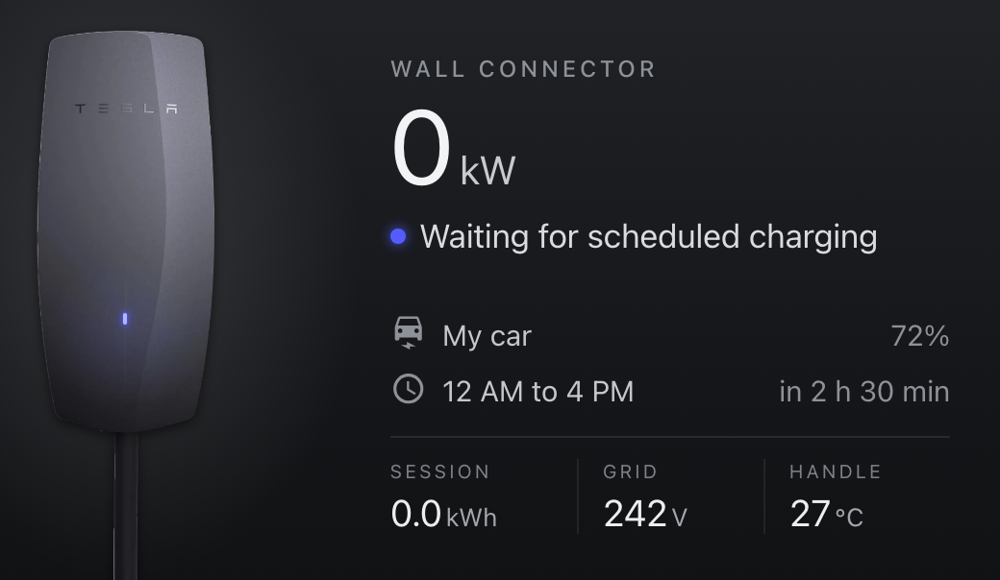
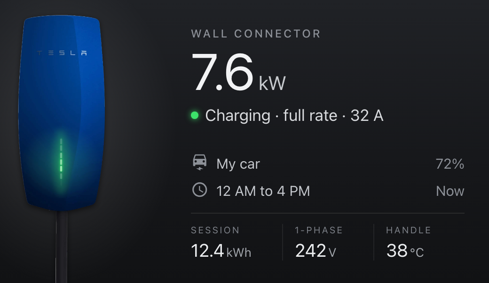
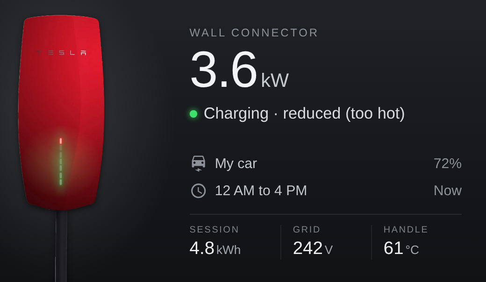
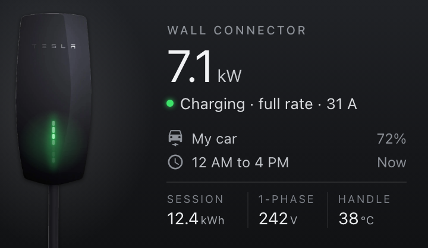
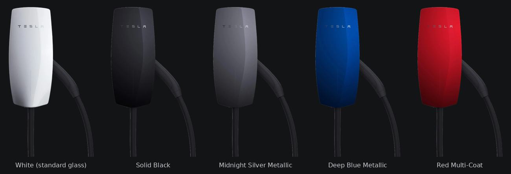

# Tesla Wall Connector card for Home Assistant

A card that shows your Gen 3 Wall Connector as it looks on the wall: Tesla's own photo, in your
faceplate colour, with a light bar that does what the real one does and the handle docked or out in
the car. Beside it are the charger's live figures from Home Assistant's built-in
[Tesla Wall Connector](https://www.home-assistant.io/integrations/tesla_wall_connector/) integration.



## What it looks like

| | |
|:---:|:---:|
|  |  |
| **Not plugged in.** The top light is green and the handle is in its holster. | **Plugged in, waiting for the schedule.** The light bar gives two blue blinks, as the real one does. |
|  |  |
| **Charging.** Green streams down the light bar. | **Charging, reduced.** The charger is too hot, so three red blinks run over the green. |

It fits a phone too:



## Faceplates

All five Gen 3 faceplates, under Tesla's names for them:



| `faceplate:` | Faceplate |
|---|---|
| `white` (default) | White, the standard glass faceplate |
| `solid_black` | Solid Black |
| `midnight_silver_metallic` | Midnight Silver Metallic |
| `deep_blue_metallic` | Deep Blue Metallic |
| `red_multi_coat` | Red Multi-Coat |

`black`, `midnight_silver`, `deep_blue` and `red` work too.

## The light bar

The card lights the bar the way Tesla's install manual says the real one lights for each state the
charger reports:

| Charger status | Real light bar | On the card |
|---|---|---|
| Not plugged in | Top green, solid (standby) | Top light green |
| Plugged in, ready, or finished | Blue, solid (car connected, not asking for charge) | One blue light |
| Plugged in, not ready to charge | Two blue blinks (held off by a schedule or access control) | Two blinks, then a pause |
| Charging | Green, streaming | Green streams down the bar, with a soft glow |
| Charging, reduced | Green streaming, with three red blinks (high temperature) | The same |
| Fault | Red blink codes | Top light red |
| Starting up | All seven lights | All seven, white |
| Offline | Nothing | Nothing |

"Plugged in, not ready to charge" is what a Wall Connector shows while its own charging schedule
holds charging off. That's two blue blinks on a real charger, which the card shows by default. If
yours does something else at that point, set `negotiating_light` (see Options).

## What the card shows

| On the card | Comes from |
|---|---|
| The light bar | the status sensor |
| Handle docked or out | the vehicle connected sensor |
| Power (kW) | the total power sensor, shown as 0 while the relay is open |
| Status line | the status, relay and vehicle sensors, and your schedule |
| Vehicle row | the vehicle connected sensor, plus your car's name and battery sensor if you give them |
| Schedule row | the charging times you give the card, and how long until the window opens |
| Session, grid, handle | the session energy, grid voltage and handle temperature sensors |

Tap the charger or any figure to open its details in Home Assistant.

### Known limitations

- **It's 30 seconds behind at most.** The integration polls the charger every 30 seconds, so the
  light bar and figures can lag the real ones by that much, and anything shorter can be missed.
- **The schedule is up to you.** The charger's local API doesn't report its charging schedule, so
  you enter the same times in the card.
- **It doesn't know which car is plugged in.** The charger only knows that a car is, so the card
  uses the name and battery sensor you give it.
- **Power while idle.** Some chargers report a few hundred milliamps with the relay open, which
  reads as about 0.1 kW. The card shows 0 kW whenever the relay is open.
- **Fault codes.** The integration doesn't say which fault, so the card shows a steady red light
  rather than the real blink code.
- **The handle is the slim North American one.** Tesla's colour-matched faceplate photos show the
  NACS handle, and the card uses that handle for every faceplate so they all match. Wall Connectors
  sold in Australia, New Zealand, the UK and Europe have a chunkier Type 2 handle, so the card's
  handle won't quite match yours there.
- **Gen 3 only.** The integration supports the Gen 3 Wall Connector (the one with Wi-Fi).

Built and tested with a Gen 3 Wall Connector (Type 2, single-phase, Australia) with a Midnight
Silver Metallic faceplate, on Home Assistant 2026.9.

## Install

You need Home Assistant 2024.11 or later with the
[Tesla Wall Connector](https://www.home-assistant.io/integrations/tesla_wall_connector/)
integration set up. It only needs the charger's IP address.

**With HACS**

1. In HACS, open the menu (⋮) → **Custom repositories**, add
   `https://github.com/CameronSmith93/Tesla-Wall-Connector-Card-HA` and choose **Dashboard** as the
   type.
2. Find **Tesla Wall Connector Card**, download it, and reload the browser when HACS asks.

**By hand**

1. Copy `dist/tesla-wall-connector-card.js` to `/config/www/` in Home Assistant.
2. **Settings → Dashboards → ⋮ → Resources → Add resource**: URL
   `/local/tesla-wall-connector-card.js`, type **JavaScript module**.
3. Reload the browser.

The card is one self-contained file: every faceplate photo is built into it.

## Add the card

**Edit dashboard → Add card**, search for **Tesla Wall Connector**, and fill in the editor. Or in
YAML:

```yaml
type: custom:tesla-wall-connector-card
faceplate: midnight_silver_metallic
vehicle_name: Model Y
vehicle_battery: sensor.model_y_battery_level
schedule:
  start: "00:00"
  end: "16:00"
```

The card is designed for a full-width slot in a sections view, and works from about 360 px wide (a phone).

### Options

| Option | Default | What it does |
|---|---|---|
| `entity_prefix` | `tesla_wall_connector` | The part shared by the charger's entities, e.g. `tesla_wall_connector` for `sensor.tesla_wall_connector_status`. A new card picks up the first Wall Connector it finds. |
| `faceplate` | `white` | Which faceplate to show (see Faceplates) |
| `name` | `Wall Connector` | The small title above the power |
| `vehicle_name` | | The car on this charger, shown while it's plugged in |
| `vehicle_battery` | | A sensor with the car's battery level, shown beside its name |
| `schedule.start`, `schedule.end` | | The charging window set on the Wall Connector (24-hour `HH:MM`). Windows that cross midnight work. |
| `negotiating_light` | `blink2` | YAML only. What the bar shows while the charger holds charging off: `blink2` (two blue blinks), `breathe` (blue, slowly pulsing) or `solid` (solid blue) |

The card reads these entities, each starting with `entity_prefix`:

| Entity | Used for |
|---|---|
| `sensor.<prefix>_status` | the light bar and status line |
| `binary_sensor.<prefix>_vehicle_connected` | the handle, and the vehicle row |
| `binary_sensor.<prefix>_contactor_closed` | power and status |
| `sensor.<prefix>_total_power` | power |
| `sensor.<prefix>_vehicle_current` | the amps while charging |
| `sensor.<prefix>_session_energy` | Session |
| `sensor.<prefix>_grid_voltage` | Grid |
| `sensor.<prefix>_handle_temperature` | Handle |

For the total power to be right on a single-phase supply, turn on the integration's
**single-phase/split-phase** option (**Settings → Devices & services → Tesla Wall Connector →
Configure**).

## What's in the repository

| Folder | What it holds |
|---|---|
| [`dist/`](dist/) | The card, ready to install: one file with every faceplate built in |
| [`src/`](src/) | The card's source |
| [`assets/`](assets/) | Tesla's photos (`photos/`) and the cut-outs the card uses (`faceplates/`) |
| [`tools/`](tools/) | `make_faceplates.py` cuts the photos out, `build.py` builds `dist/`, `preview.html` shows the card without Home Assistant, `screenshots.js` and `make_docs.py` make the images in this README |
| [`docs/`](docs/) | The images in this README |

## Changing the card

Edit `src/tesla-wall-connector-card.js`, then from the repository root:

```sh
python3 tools/build.py
```

Open `tools/preview.html` in a browser to see every faceplate in every state with made-up figures.

To make the faceplate images again from the photos (for example with a new photo), see
[`assets/`](assets/). To redo the README images:

```sh
npm install --no-save playwright && npx playwright install chromium
node tools/screenshots.js
python3 tools/make_docs.py
```

## How it works

- The charger is a cut-out of Tesla's front-on product photo, with the lit light bar painted out.
  There are two per faceplate, handle docked and handle out, and the card swaps between them when
  a car is plugged in or unplugged. All five share one handle, cable and outline, so they line up exactly.
- The light bar is seven lights laid over the photo where the real ones are, animated with CSS:
  streaming, blinking or steady, with a glow on the faceplate. On the white glass faceplate the
  lights are white with a coloured glow; on the colour-matched faceplates they're coloured lines,
  closer to how they look against a dark faceplate.
- Everything is sized to the card's width, so it looks the same from a phone to a wide screen.
- The card is a single JavaScript file with the photos built in as WebP, so there's nothing else to
  copy into Home Assistant.

## Trademarks and credits

Made by Cameron Smith, with Claude (Anthropic).

Tesla, Wall Connector and the Tesla logo are trademarks of Tesla, Inc. This project isn't affiliated
with or endorsed by Tesla. The charger photos in `assets/photos/` are Tesla's product images from
the [Tesla shop](https://shop.tesla.com/), and the light bar codes come from Tesla's
[Wall Connector 3 install manual](https://energylibrary.tesla.com/docs/Public/Charging/WallConnector/Gen3/Install/APAC/gen-3-wall-connector-manual-en-sg.pdf).

Icons are from [Material Design Icons](https://pictogrammers.com/library/mdi/) (Apache 2.0).

## Licence

Code: MIT, see [LICENSE](LICENSE). The licence doesn't cover Tesla's photos or the images made from
them, including the copies built into `dist/tesla-wall-connector-card.js`.
